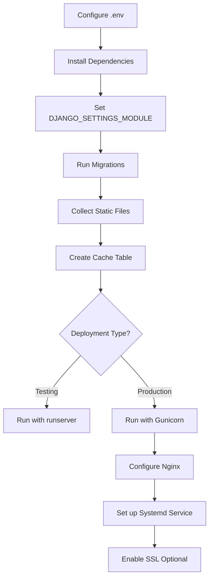

# GiftTree - Production Deployment Configuration

## Overview

Your GiftTree application has been configured for **flexible production deployment** with the **same SQLite database** as development. You can deploy it easily without needing PostgreSQL or Redis.

---

## What's Been Configured

### ✅ Settings Structure
- **Base Settings** ([gifttree/settings/base.py](gifttree/settings/base.py)) - Common settings for all environments
- **Development Settings** ([gifttree/settings/development.py](gifttree/settings/development.py)) - Local development
- **Production Settings** ([gifttree/settings/production.py](gifttree/settings/production.py)) - Production deployment

### ✅ Key Features
- **Flexible Database**: Uses SQLite by default (same as dev), can upgrade to PostgreSQL later
- **Configurable HTTPS**: Can run with or without SSL/HTTPS
- **Static File Handling**: WhiteNoise serves static files efficiently
- **Cache Options**: Database cache (default) or Redis (optional)
- **Security**: Production-ready security settings

---

## Quick Start

### 1. Configure Environment Variables

Copy `.env.production.example` to `.env` and update:

```bash
SECRET_KEY=your-new-secret-key
DEBUG=False
ALLOWED_HOSTS=yourdomain.com,your-ip
DB_ENGINE=sqlite3
ENABLE_HTTPS=False
```

### 2. Install Production Dependencies

```bash
pip install -r requirements.txt
```

### 3. Deploy

```bash
export DJANGO_SETTINGS_MODULE=gifttree.settings.production
python manage.py migrate
python manage.py collectstatic --noinput
python manage.py createcachetable
gunicorn gifttree.wsgi:application --bind 0.0.0.0:8000
```

---

## Deployment Options

### Option 1: Simple Deployment (SQLite + HTTP)
Perfect for small to medium sites, internal tools, or testing.

**Pros:**
- ✅ Same configuration as development
- ✅ No external database setup needed
- ✅ Easy to backup (single file)
- ✅ Quick deployment

**Limitations:**
- Limited to ~100 concurrent users
- Single file database

**Configuration:**
```bash
DB_ENGINE=sqlite3
ENABLE_HTTPS=False
CACHE_BACKEND=db
```

### Option 2: Production with HTTPS (SQLite + SSL)
For public-facing sites with SSL certificate.

**Configuration:**
```bash
DB_ENGINE=sqlite3
ENABLE_HTTPS=True
CACHE_BACKEND=db
```

### Option 3: High Performance (PostgreSQL + HTTPS + Redis)
For high-traffic sites.

**Configuration:**
```bash
DB_ENGINE=postgresql
DB_NAME=gifttree_db
DB_USER=gifttree_user
DB_PASSWORD=strong_password
ENABLE_HTTPS=True
CACHE_BACKEND=redis
REDIS_URL=redis://127.0.0.1:6379/1
```

---

## Documentation Files

| File | Purpose |
|------|---------|
| [PRODUCTION_DEPLOYMENT.md](PRODUCTION_DEPLOYMENT.md) | Complete deployment guide with all steps |
| [QUICK_DEPLOY.md](QUICK_DEPLOY.md) | Quick reference for common tasks |
| [.env.production.example](.env.production.example) | Example environment configuration |
| [deploy.sh](deploy.sh) | Automated deployment script |

---

## Configuration Reference

### Environment Variables

| Variable | Default | Description |
|----------|---------|-------------|
| `SECRET_KEY` | - | Django secret key (required) |
| `DEBUG` | False | Debug mode (False for production) |
| `ALLOWED_HOSTS` | localhost | Comma-separated list of allowed hosts |
| `DB_ENGINE` | sqlite3 | Database engine (sqlite3/postgresql) |
| `ENABLE_HTTPS` | False | Enable HTTPS security features |
| `CACHE_BACKEND` | db | Cache backend (db/redis) |
| `EMAIL_BACKEND` | smtp | Email backend |

### Database Options

**SQLite (Default):**
```bash
DB_ENGINE=sqlite3
# No other DB settings needed
```

**PostgreSQL:**
```bash
DB_ENGINE=postgresql
DB_NAME=gifttree_db
DB_USER=gifttree_user
DB_PASSWORD=your_password
DB_HOST=localhost
DB_PORT=5432
```

---

## File Structure

```
gifttree/
├── apps/                    # Django apps
├── gifttree/
│   ├── settings/
│   │   ├── base.py         # Base settings
│   │   ├── development.py  # Dev settings
│   │   └── production.py   # Production settings
│   ├── urls.py
│   └── wsgi.py
├── static/                  # Static source files
├── staticfiles/            # Collected static files
├── media/                  # Uploaded media
├── templates/              # HTML templates
├── logs/                   # Application logs
├── .env                    # Environment variables
├── requirements.txt        # Python dependencies
├── deploy.sh              # Deployment script
└── manage.py              # Django management
```

---

## Deployment Workflow



---

## Common Commands

### Deployment
```bash
# Set environment
export DJANGO_SETTINGS_MODULE=gifttree.settings.production

# Database
python manage.py migrate
python manage.py createcachetable

# Static files
python manage.py collectstatic --noinput

# Run application
gunicorn gifttree.wsgi:application --bind 0.0.0.0:8000 --workers 3
```

### Maintenance
```bash
# Backup database
cp db.sqlite3 backups/db_$(date +%Y%m%d).sqlite3

# Clear cache
python manage.py clear_cache

# Create superuser
python manage.py createsuperuser
```

### Monitoring
```bash
# View logs
tail -f logs/gunicorn-error.log
tail -f logs/django.log

# Check service status
sudo systemctl status gifttree
```

---

## Security Checklist

Before going live:

- [ ] Set strong `SECRET_KEY`
- [ ] Set `DEBUG=False`
- [ ] Configure `ALLOWED_HOSTS` correctly
- [ ] Set up HTTPS (if possible)
- [ ] Update Razorpay keys to live keys
- [ ] Configure email settings
- [ ] Set file permissions correctly
- [ ] Set up database backups
- [ ] Configure firewall
- [ ] Test payment flow end-to-end

---

## Migration Path

### From Development to Production (SQLite)
1. Copy `db.sqlite3` to production server
2. Copy `media/` folder to production server
3. Configure `.env` for production
4. Deploy using steps above

### From SQLite to PostgreSQL (Later)
1. Backup SQLite database
2. Install PostgreSQL
3. Create new database
4. Update `.env` with PostgreSQL settings
5. Export data: `python manage.py dumpdata > data.json`
6. Load data: `python manage.py loaddata data.json`

---

## Performance Optimization

### When to Upgrade

| Metric | SQLite OK | Consider PostgreSQL |
|--------|-----------|---------------------|
| Concurrent Users | < 100 | > 100 |
| Daily Orders | < 500 | > 500 |
| Database Size | < 10GB | > 10GB |
| Write Operations | Low | High |

### Optimization Tips

1. **Enable Redis Cache**
   ```bash
   CACHE_BACKEND=redis
   ```

2. **Use CDN for Media Files**
   - Configure AWS S3 or similar

3. **Enable HTTPS**
   - Better performance with HTTP/2
   - Required for modern payment gateways

4. **Optimize Images**
   - Compress media files
   - Use image optimization tools

---

## Support & Resources

### Getting Help
- Review [PRODUCTION_DEPLOYMENT.md](PRODUCTION_DEPLOYMENT.md) for detailed instructions
- Check [QUICK_DEPLOY.md](QUICK_DEPLOY.md) for quick reference
- Review Django documentation: https://docs.djangoproject.com/

### Monitoring
- Application logs: `logs/gunicorn-error.log`
- Django logs: `logs/django.log`
- System logs: `/var/log/nginx/`, `/var/log/syslog`

---

## Next Steps

1. **Deploy to Server**: Follow [QUICK_DEPLOY.md](QUICK_DEPLOY.md)
2. **Configure Domain**: Point DNS to your server
3. **Set Up SSL**: Use Let's Encrypt for free SSL
4. **Test Everything**: Verify all features work
5. **Monitor**: Set up monitoring and alerts
6. **Backup**: Schedule regular database backups

---

**Your application is ready for production deployment with the same SQLite configuration as development!**

For questions or issues, refer to the detailed documentation or check the application logs.
